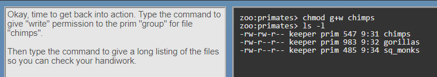

## Kottans-frontend course from [Kottans](https://kottans.org/)
Repo for Kottans frontend course.

## Git

I was familiar with git / github for a long time, but I used it only from github desktop. Learned a lot of useful things =)

**Finished course git/github at udacity**

## Linux CLI, and HTTP

* mkdir - create new dir 
* cd - change location
* pwd - current location
* ls - current dir content
* mv - renaming and transferring content
* more - current file content
* cp - copying from one dir to another
* rm - remove from spec dir
* rmdir - remove spec dir
* chmod - rights administration
* man - check commands, for example: 'man -k user' 
* df - disk usage

# URLs

