# Kottans-frontend course from [Kottans](https://kottans.org/)
Repo for Kottans frontend course.

## Git

I was familiar with git / github for a long time, but I used it only from github desktop. Learned a lot of useful things =)

**Finished course git/github at udacity**

## Linux CLI, and HTTP

* mkdir - create new dir 
* cd - change location
* pwd - current location
* ls - current dir content
* mv - renaming and transferring content
* more - current file content
* cp - copying from one dir to another
* rm - remove from spec dir
* rmdir - remove spec dir
* chmod - permissions
* man - check commands, for example: 'man -k user' 
* df - disk usage

**Some useful screens**

chmod

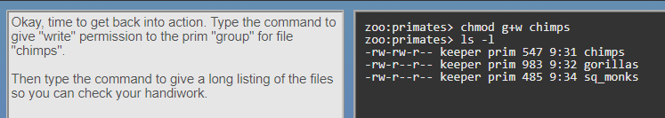

Linux quiz 3

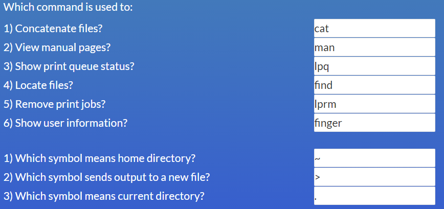

Linux quiz 4

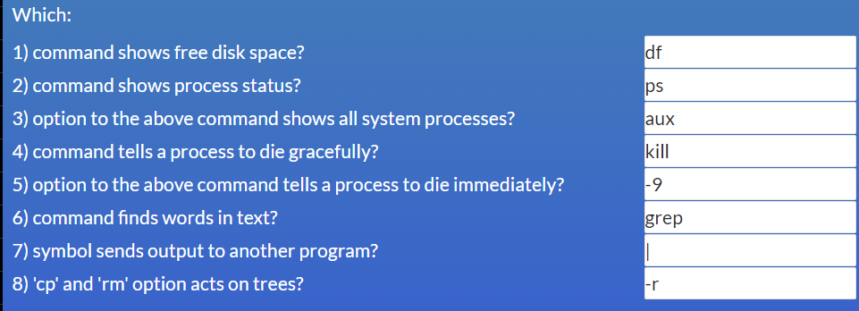

URLs

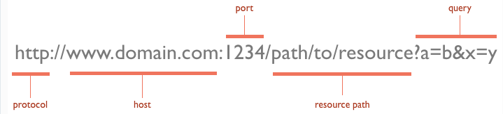

## Git Collaboration

When working with a project that you've forked. The original project's maintainer will continue adding changes to their project. You'll want to keep your fork of their project in sync with theirs so that you can include any changes they make.

To get commits from a source repository into your forked repository on GitHub you need to:

* get the cloneable URL of the source repository
* create a new remote with the **git remote add** command
	* use the shortname **upstream** to point to the source repository
	* provide the URL of the source repository
* fetch the new **upstream** remote
* merge the **upstream**'s branch into a local branch
* push the newly updated local branch to your **origin** repo

**Some useful screens**

git_log

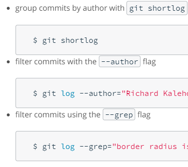

to make sure I'm on the correct branch for meging
* $ git checout master
merge in "somebody's" changes
* $ git merge upstream/master
send "somebody's" changes to "my" remote
* $ git push origin master

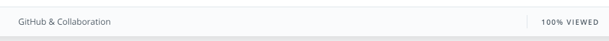

learngitbranching_1

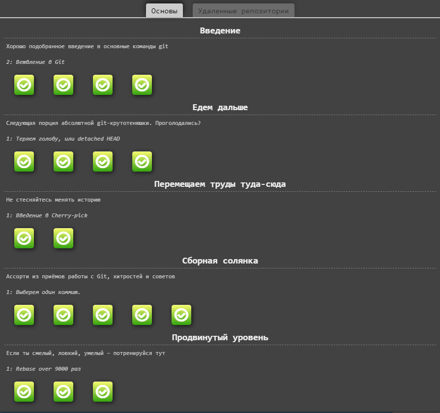

learngitbranching_2

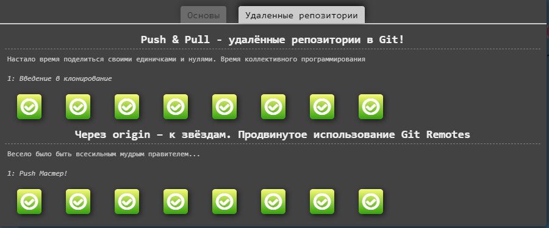

**Useful links**

* [ohshitgit.com](https://ohshitgit.com) - **cool stuff**

* [git-flight-rules](https://github.com/k88hudson/git-flight-rules)

## Intro to HTML and CSS

Recently studied html and css, nothing new to me. Repeated some things like grid.

There's got to be a better way

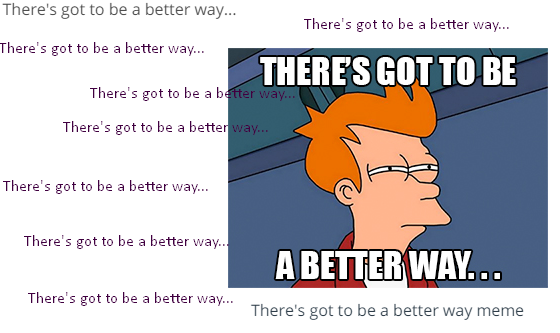 - **There's got to be a better way**

Codecademy_html

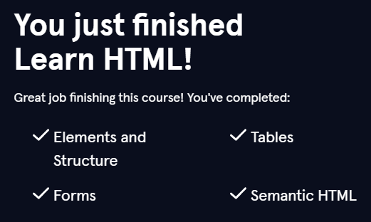

Codecademy_css

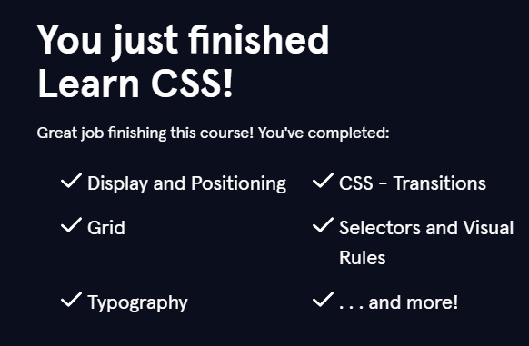

## Responsive Web Design

It was not easy, but I am sure I will understand a couple of things later. More practice - more confidence. 

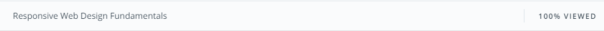

Froggy

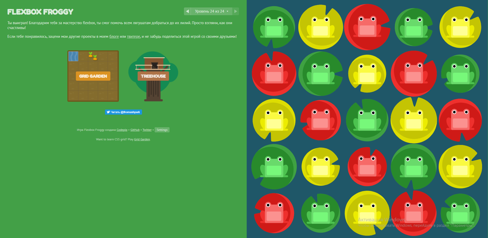

Gridgarden

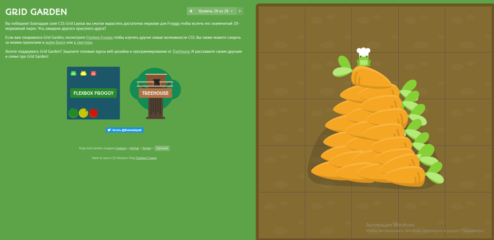

