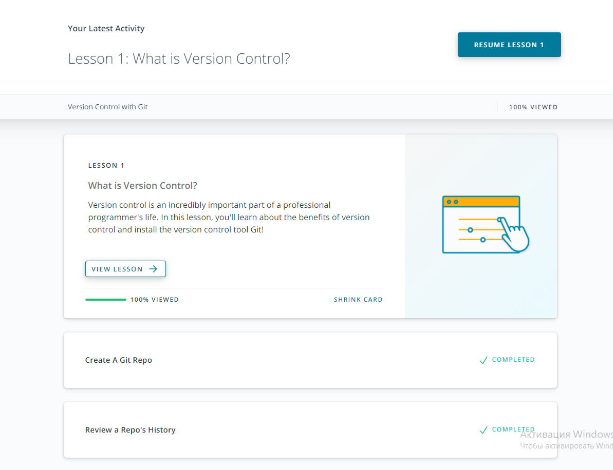
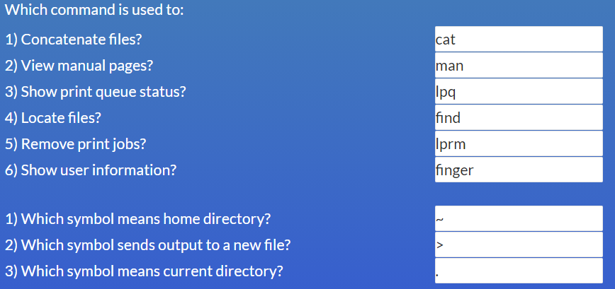
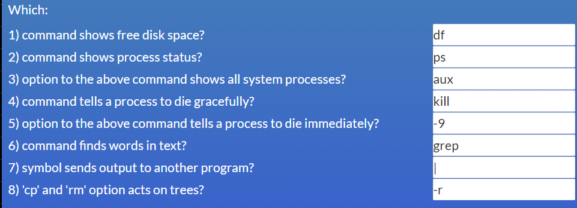

# Kottans-frontend course from [Kottans](https://kottans.org/)
Repo for Kottans frontend course.

# Git

С git / github знаком был давно, но использовал только через github desktop. Узнал много полезных вещей=)

**Закончил курс по git and github на udacity**

# Linux, Command Line, HTTP Tools

* mkdir - создать новую дир 
* cd - сменить местополежие
* pwd - текущее местоположение
* ls - контент текущей директории
* mv - для переименований и для переноса контента
* more - контент текущего файла
* cp - копирование из одной дир в другую
* rm - удаление из опред. дир 
* rmdir - удаление опред. дир
* chmod - управление правами
* man - узнать комманды, например: 'man -k user' 
* df - disk usage

